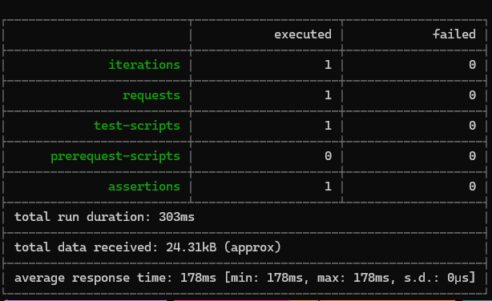
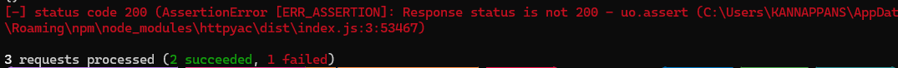

# ApiTesting
Explore different Tools to test APIs

## Postman Collection with Newman CLI
Export the Collection from Postman in v2.1
Steps to run the tests,
1. Install newman CLI
    ```bash
    npm install -g newman
    ```
2. run the test using httpyac with the below command
    ```bash
    newman run .\PostmanTests\todos.postman_collection.json
    ```



## Http Files
Files with .http extensions that allows to send http requests 
It supports, 
* running scripts to set variables 
* Asserting the response status code, fields etc


Tests can be run from, 
* Visual Studio
* [Intellj HTTP Client](https://www.jetbrains.com/help/idea/http-client-in-product-code-editor.html)
* VSCode Extensions,
    * [Rest Client](https://marketplace.visualstudio.com/items?itemName=humao.rest-client), 
    * [Httpyac](https://marketplace.visualstudio.com/items?itemName=anweber.vscode-httpyac)

* Command line using,
    * [Intellj HTTP Client CLI](https://blog.jetbrains.com/idea/2022/12/http-client-cli-run-requests-and-tests-on-ci/),
    * [Httpyac](https://httpyac.github.io/guide/installation_cli.html)


## Example
In this example test, there are three tests,<br>
1. Fetch all Todos from API<br>
    * Asserts on the response status code,
    * Sets the variable todoId to be used in the next tests
2. Fetch Todo Items based on Id saved from previous test
    * Asserts on the response status code
3. Fetch Todo Items based with invalid url to get 404 to simulate failure
        

## Running the tests
I tried to run these tests with Httpyac CLI.
Steps to run the tests,
1. Install Httpyac CLI
    ```bash
    npm install -g httpyac 
    ```
2. run the test using httpyac with the below command
    ```bash
    httpyac Tests.http -all -o response -v
    ```
    
