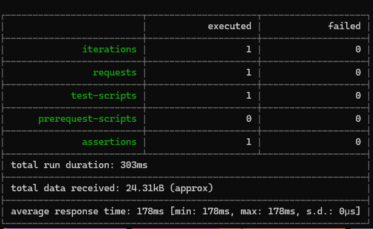
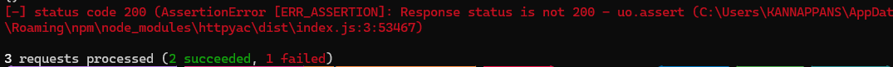
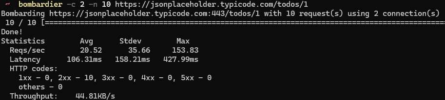

# ApiTesting
Explore different Tools to test APIs

# Tools
1. [Postman + Newman CLI](#postman-collection-with-newman-cli)
2. [Http Files](#http-files)
    * [Running tests from IDE/CodeEditor](#running-tests-from-idecode-editor)
    * [Running tests using CLI - httpyac](#running-the-tests-using-httpyac)
3. [Playwright .net](#playwright-tests)
4. [.net HttpClient](#net-httpclient)
5. [Commandline](#commandline-options)
    * [cURL](#1-curl)
    * [httpie](#2-httpie)
    * [Bombardier](#3-bombardier)
## Postman Collection with Newman CLI

Examples available [here](01_PostmanTests) <br>

### Export
Export the Collection from Postman in v2.1

### Running the tests
Steps to run the tests,
1. Install newman CLI
    ```bash
    npm install -g newman
    ```
2. run the test using httpyac with the below command
    ```bash
    newman run .\PostmanTests\todos.postman_collection.json
    ```



## Http Files
Files with .http extensions that allows to send http requests 
It supports, 
* running scripts to set variables 
* Asserting the response status code, fields etc


### Running tests from IDE/Code Editor 
* [Visual Studio](https://learn.microsoft.com/en-us/aspnet/core/test/http-files?view=aspnetcore-8.0)
* [Intellj HTTP Client](https://www.jetbrains.com/help/idea/http-client-in-product-code-editor.html)
* VSCode Extensions,
    * [Rest Client](https://marketplace.visualstudio.com/items?itemName=humao.rest-client), 
    * [Httpyac](https://marketplace.visualstudio.com/items?itemName=anweber.vscode-httpyac)

### Command line Options
    * [Intellj HTTP Client CLI](https://blog.jetbrains.com/idea/2022/12/http-client-cli-run-requests-and-tests-on-ci/),
    * [Httpyac](https://httpyac.github.io/guide/installation_cli.html)


### Example using httpyac

Examples available [here](02_httpFiles) <br>

In this example test, there are three tests,<br>
1. Fetch all Todos from API<br>
    * Asserts on the response status code,
    * Sets the variable todoId to be used in the next tests
2. Fetch Todo Items based on Id saved from previous test
    * Asserts on the response status code
3. Fetch Todo Items based with invalid url to get 404 to simulate failure
        

### Running the tests using httpyac CLI
I tried to run these tests with httpyac CLI.
Steps to run the tests,
1. Install Httpyac CLI
    ```bash
    npm install -g httpyac 
    ```
2. run the test using httpyac with the below command
    ```bash
    httpyac Tests.http -all -o response -v
    ```
    


## Playwright tests

https://playwright.dev/dotnet/docs/api-testing

Example available [here](03_Playwright) <br>

## .Net HttpClient

API Requests can be made using .Net Http Client and results can be verified <br>
Example available [here](04_httpClient.Net) <br>

## Commandline Options

### 1. cURL

This is my default CLI tool to send API requests,

```powershell
curl --location 'https://jsonplaceholder.typicode.com/todos/1'
```

#### Parse data using jq

```powershell
curl --location 'https://jsonplaceholder.typicode.com/todos' | jq '.[].title'
```

### 2. httpie

https://httpie.io/

```powershell
choco install httpie
```
#### Example
```powershell
 http https://jsonplaceholder.typicode.com/todos/1
```

```
http POST pie.dev/post < files/data.json
```

### 3. Bombardier

This is my favourite tool to fire a quick performace tests on an API. 

https://github.com/codesenberg/bombardier

```powershell
bombardier -c 2 -n 10 https://jsonplaceholder.typicode.com/todos/1
```
### Output
